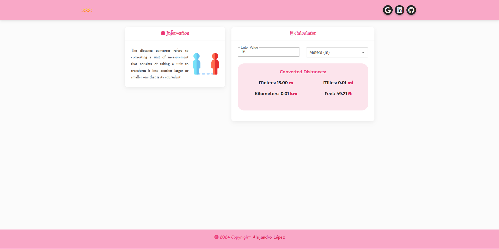

# <h1 align="center" style="color: #80cbc4;"> Distance Converter 👨🏻‍💻 </h1> 
  

In mathematics, the distance between two points in Euclidean space is equivalent to the length of the segment of the line that joins them, expressed numerically.

The following web app is a ` distance conversion tool ` that makes it easy to convert between miles, kilometers, meters and feet, allowing you to convert distances quickly and accurately no matter what unit you start with. 

    

 

## 
 Requirements 

- [HTML5](https://developer.mozilla.org/es/docs/Web/HTML) 
- [CSS3](https://developer.mozilla.org/es/docs/Web/CSS)
- [JavaScript](https://developer.mozilla.org/es/docs/Web/JavaScript)
- [BootStrap](https://mdbootstrap.com/)

## 
 Screenshot Project 💻 

🔶 [Project Website](https://alejandro-190107.github.io/Distance-Converter/)

